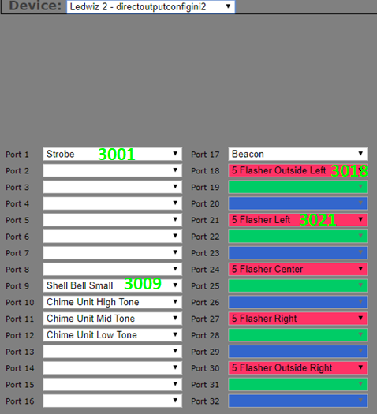

# DOF to DOFLinx Device and Port Assignments

_This guide is designed to help you understand the relationship between DOF settings and DOFLinx configuration.  If you just have DOF installed for the drivers (ie using on a MAME cabinet), then you do not need a DOF setup so this is probably not relevant._

So, you have setup DOF and now want to translate those toys for use in DOFLinx.  It is fairly easy once you get the hang of it.

Everywhere in DOFLinx the assignment of a toy needs a four digit assignment in the form of DOOO, where D is the device number and OOO is the output.  For example, to setup the Left Flipper the line in the DOFLinx.INI configuration file will be:

LINK\_LF= ……

For the parameter order and details see the full guide for each different line.  In all cases, the first item will be the device/port.  For my cabinet the line looks like:

LINK\_LF=2017,50,5000,255

In the DOF Config Tool you setup each output controller you have and assign the toys.  Each type of controller starts numbering from 1.  So, if you have two LEDWiz and a Pinscape you will have LEDWiz #1, LedWiz #2 and Pinscape #1.  You can see this in the screen shots below for my cabinet configuration.

For DOFLinx the controller devices start being numbered at #1 and continue from there.  This is with the exception of a Teensy / wesmos controller used for addressable LEDs, that is not assigned a controller ID # by DOFLinx as you never link directly to the addressable LED toys.

The numbering for devices in DOFLinx starts with Pinscape Controllers, then LEDWiz, and works through all the other supported controllers.  The easiest way to get the device numbers is to just look at DOFLinx’s log screen / file.

You can see that there is one output device, a Pinscape, with 24 outputs.  This means that your toys can be connected to D =1 and OOO=001 to 024 in the format DOOO.  So if your Right Flipper is connected to the Pinscape port #9 then your would use DOOO = 1009.  The parameter line in your DOFLinx.ini would look something like:

LINK\_RF=1009,50,5000,255

For my cabinet my DOFLinx log looks like this:

This means that for my pinball cabinet the devices in DOFLinx are:

Device #1  Pinscape

Device #2 = LEDWiz #1

Device #3 = LEDWiz #2

I can possibly have toys connected to D=1, 2 or 3.  For the LEDWiz with 32 outputs OOO can be 001 to 032 inclusive.  For the Pinscape OO can be 001 to 022.  This gives 101-122, 201-232,301-332 as valid outputs for my toys. 

Do remember of course that RGB toys are specified by their RED port.  So if you have RGB lighting connected to device #2 ports 9, 10, 11 for RED, GREEN and BLUE the RGB\_OUTPUT= DOOO will be 2009, the RED port.

This means the translation from my DOF Configuration Tool setup to DOFLinx is (I only wrote enough numbers on there in lime green to show the pattern, I’m sure the rest is quite obvious):

Below is the main toy definition section of my current cabinet file.

