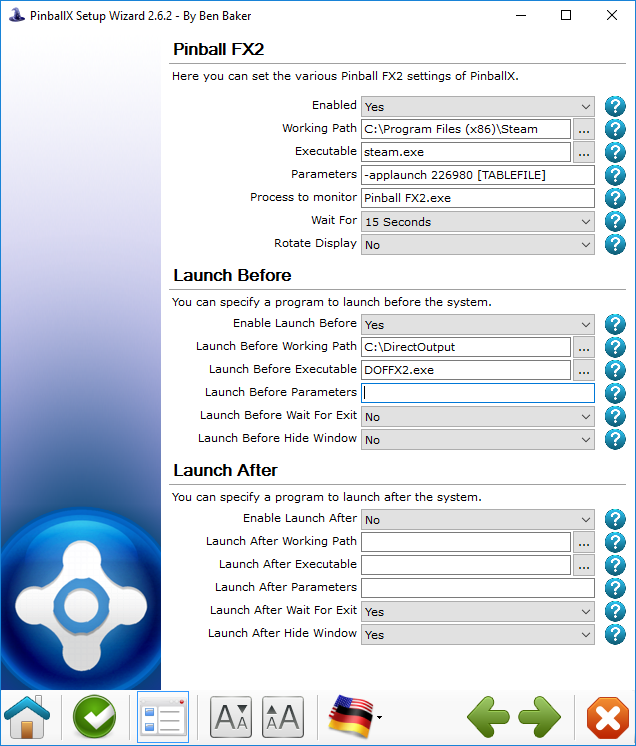
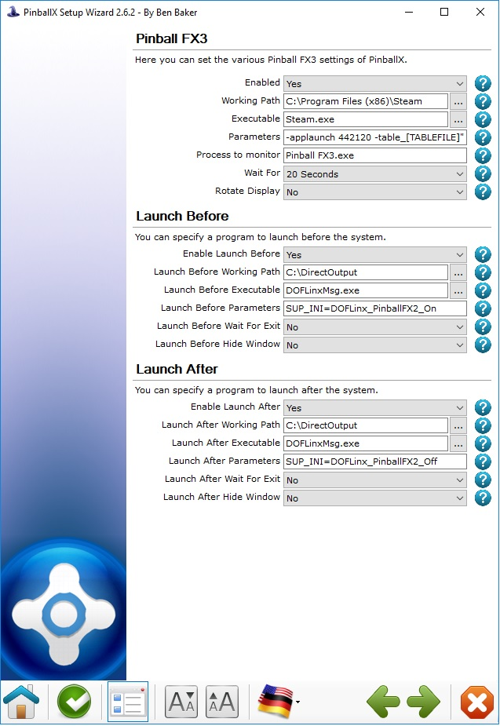
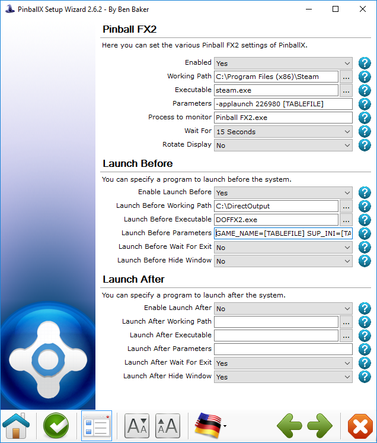

# Examples & Screen Shots

## Setup as 'Set and Forget'

Go to your start-up folder

Create a shortcut

End up with it in your start-up items

## Where to Find the Names for the "PROCESSES=" Parameter

There are two ways to do this;

1. Via DOFLinx itself
   1. Start DOFLinx with DEBUG=1
   1. Right click on the message logging list box
   1. Select the "Show Running Processes" menu option
   1. Note down the relevant name from the list
2. Look in Task Manager as per the images below;

Locate the process you want to monitor, right click and use the name as
you see below (VPinball_9_9_1) without the EXE. Nb, your name is likely
to be different, this is just how I have VP version 9.9.1 named.

## Add Flipper Force Feedback to Selected VP Tables

Ensure you have your VP process as one of the processes in your
PROCESSES= parameter, ie "PROCESSES=Pinball FX2,VPinball_9_9_1". In
fact, it is more likely to be the process name for your old versions of
VP since almost everything VPX is DOF enabled (yay!)

Setup your 'Launch Before' and 'Launch After' in your favourite front
end like the sample below. You can send messages to DOFLinx in multiple
ways, below shows it done using the small utility provided.

Create a dummy file named "TABLEFILE.DOFLINX" in your VP tables folder.
The "TABLEFILE" name is the same name as you VPT or VPX, and B2S file
for that table. This can be seen in the example below.

The logic is:

1. DOFLinx is running in Set and Forget mode
1. The 'Launch Before' program tells DOFLinx the current GAME_FLAG_FILE
  to look for
1. When the VP process starts DOFLinx checks if the flag file exists
1. If a flag file is set to something, then one of two things can
  happen;
    1. The file name provided exists, in which case DOFLinx 'wakes up'
    1. The file name provided does not exist, in which case DOFLinx stays 'sleeping'

!!! note

    The end result is that DOFLinx runs in the background at all times
    monitoring for VP, but only selectively 'wakes up' when a flag file is
    present. This allows VP to be monitored at all times and wake as
    required.

## PinballX Launch Before

The following setting will launch DOFLinx before PinballX starts each
time. To ensure it runs right, your INI file for this setup should have:

PROCESSES=Pinball FX2,Process2,Process3 (or leave it out altogether as
Pinball FX2 is the default process)

FORCE_ACTIVE=0 (or leave it out of the INI altogether as this is the
default)

QUIT_AFTER_PROCESS=1 (This ensures DOFLinx stops when the PinBall FX2
process disappears)

If you want to send DOFLinx a set game name (to override the automatic
pick of the Game Name from the Pinball FX2 window), and a supplementary
INI file you'd do this:

## Windows 8 and LUA

It has been reported that on Windows 8 the following change to disable
LUA may be required.

I made this change in this way:

1. Run RegEdit:
2. Set the key: `HKEY_LOCAL_MACHINE \ SOFTWARE \ Microsoft \ Windows
  \ CurrentVersion \ Policies \ System \ EnableLUA` to 0.
