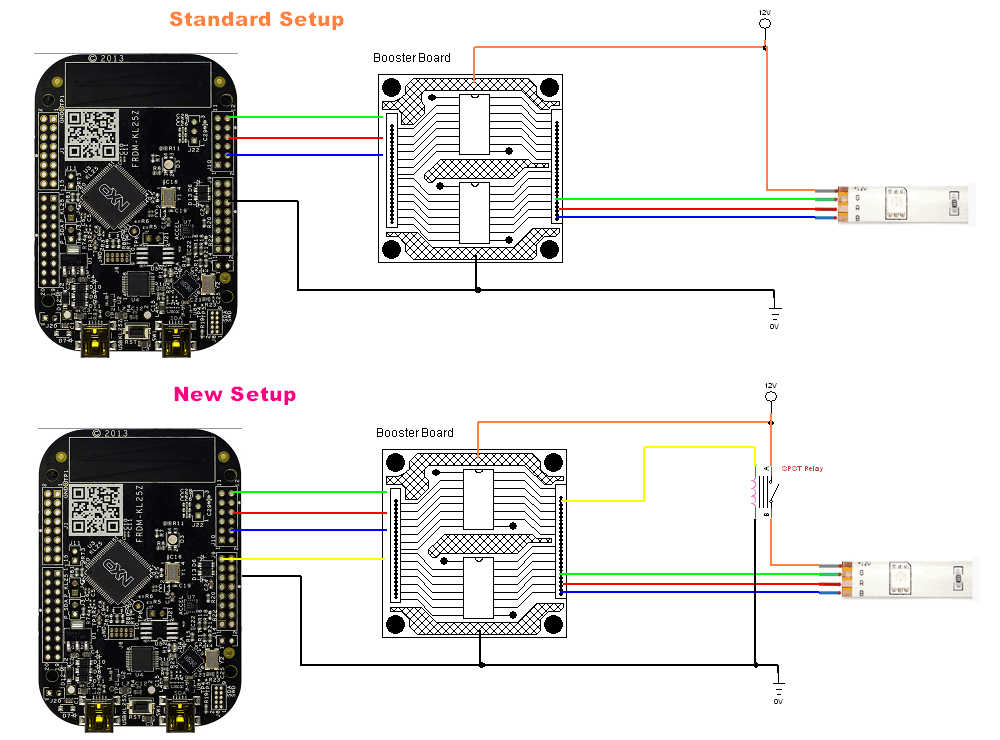
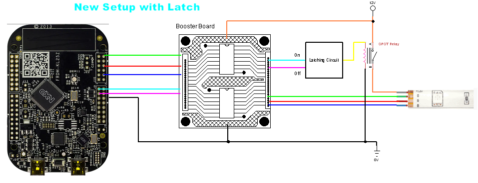
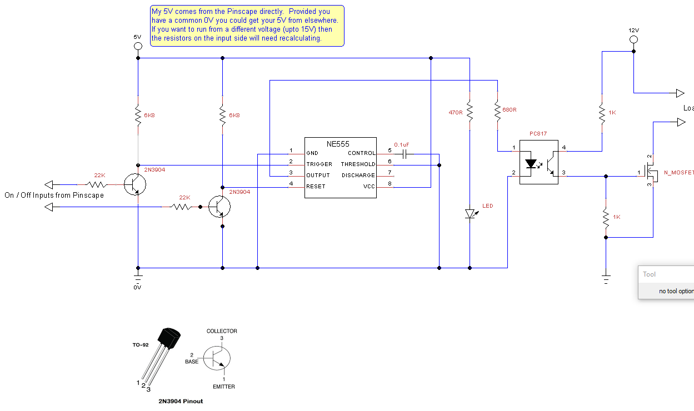
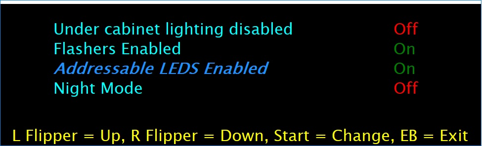

# Settings Pop Up Menu

The setting pop up menu is designed to allow you to control items within
your cabinet. It is not about configuring DOFLinx. There are two types
of settings, items that turn device ports on / off and hence control
cabinet items electrically, plus one special setting for NIGHT mode.

To use settings that control electrical items, you must have those
electrical items wired up appropriately. In my case I wanted to be able
to turn on / off some of my lighting effects easily so that different
people in my house like / don't like. I started off by having a physical
switch inside the cabinet to switch the positive rail of the under
cabinet lighting, I got sick of that. So then I installed a relay
instead of that switch, the control for that relay is wired to another
LEDWiz output. This means by switching the output to the relay I can
electrically switch on / off my under cabinet lighting. The reason I
didn't want to do this via configuration and disable it is because there
are multiple configurations and they have a habit of going wrong at some
stage, this is a quick and simple way.

Below is the standard connection for a toy from your device.

Above is the modified connection to allow control via the Settings
option. It differs by the addition of a relay on the switch power line
to the toy. The relay is controlled via another output device output
port.

Each time an application opens the DOF framework it resets the outputs
on each device. DOFLinx opens and closes DOF as required when tables /
emulators are started and stopped. To avoid the relay resetting for your
output it is possible (and desirable) to add a latching circuit. That
means one signal to turn on a relay / MOSFET and another to turn it off.
Doing this ensures that the device you are controlling remains on / off
until you specifically change that setting. A logical diagram of this is
below.

A cheap and easy latching circuit that I have used with a Pinscape is
shown below.

The Settings pop up menu is a bit reminiscent of a traditional pinball
configuration on the DMD. As such I've made it so you can drag the pop
up menu to your DMD (or what ever screen you like) and size it
appropriately. When you exit the location and size will be saved in the
registry for next time. (HKEY_LOCAL_USER\Software\DOFLinx\XX. If
anything goes wrong you can safely delete the entire DOFLinx tree from
the registry, it will recreate next time.

There is one "special", and hence reserved, ID code that can be used,
that is "NIGHT", so "SETTING=NIGHT ". This special setting allows the
internal DOFLinx flag for NIGHT_MODE to be toggled.

An example of the configuration that would produce the settings pop up
above and use Left Shift + Right Shift + Left Control + Right Control
(all flipper and magna save buttons in my case) at the same time, along
with Left Shift for UP, Right Shift for DOWN, Escape for EXIT and 0 for
CHANGE is:

> SETTING_ACTIVATE=A0,A1,A2,A3

> SETTING_UP=A0

> SETTING_DOWN=A1

> SETTING_CHANGE=31

> SETTING_EXIT=1B

> SETTING_MESSAGE=L Flipper = Up, R Flipper = Down, Start = Change, EB =
> Exit

> SETTING=UnderCab,101,Under cabinet lighting disabled,Off,Y

> SETTING=Flashers,102,Flashers Enabled,On,Y

> SETTING=Addressable,103,Addressable LEDS Enabled,On,N

> SETTING=NIGHT,,Night Mode,Off,Y
