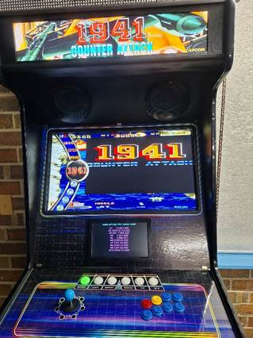
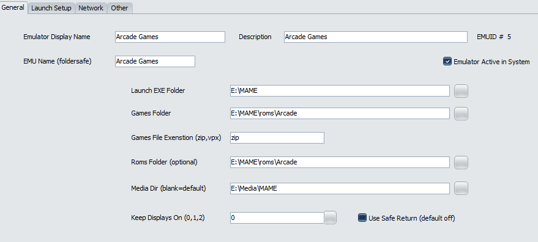
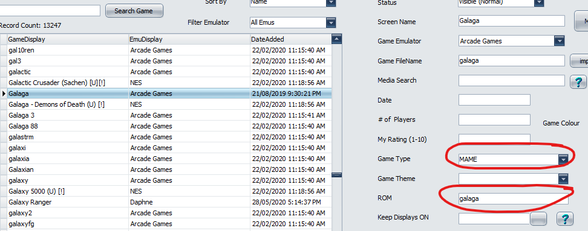
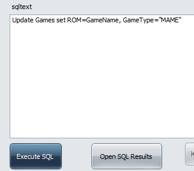

# Pinup Popper

If you are using Pinup Popper for your arcade menu along with DOFLinx on your arcade machine, then you can have Popper send details of the current game select so that DOFLinx can update things like a Pixelcade or DMD supported by FlexDMD via DOF2DMD for marquees and high scores.

In addition you can setup to perform any of the DOFLinx actions (solenoids, SSF, Flashers, addressable LEDs, etc) for Next, Prior, Next Page, Prior Page navigation.

Here is the game name and high scores being displayed on the built in DOFLinx score screen.  If you have a Pixelcade device or DMD using FlexDMD it will display the marquee and optionally high scores dependant on the parameters you setup in your DOFLinx.ini  If you have a DMD screen using FlexDMD then you will need the DOF2DMD utility available here [https://github.com/DMDTools/DOF2DMD/releases](https://github.com/DMDTools/DOF2DMD/releases)

To do this you will need to edit two of your Pinup Popper files.  I have included copies of my files in the “\\DOFLinx\\PinUp Popper” folder within the installation zip.  They are PUPMenuScriptSysOptions.ini and PuPMenuScript.pup .  Ensure you make a backup of both files before starting to edit just in case the edits don’t go according to plan.

The change to  PUPMenuScriptSysOptions.ini is to add the highlighted line in approximately the area shown below:

> useDOF = false ;               // set to true if using DOF output with Popper. false = disabled
> 
> useDMD = false ;               // set to true if using hardware dmddevice.DLL, for real DMDs. false = disabled
> 
> useWEB = false ;               // set to true if using WebServer for Remote control of Popper. false = disabled
> 
> **useDOFLinx = true;            // Set to true if using DOFLinx to show marquees for MAME**
> 
> NoBracketText = 0 ;      // set to 1 to NOT display any text within brackets for the Game's "Screen Name"

The second file requiring editing is PuPMenuScript.pup . You will need to add three small sections that are highlighted.  I recommend using cut and paste from this document as case and spacing is important.  I’ve left sections one either side of the highlighted piece you require below to help with determining where to add the code.

First addition

    /////////////////////////////////// END WEB Remote STUFFS ////////////////////////////////////////////////
    //////////////////////////////////// DOFLinx STUFF ///////////////////////////////////////

    function ProcessDOFLinx(gtype, rom){
    if (useDOFLinx) {
    try {
          msg = 'MENU_ROM=';
          msg = msg.concat(gtype, ',', rom);
          var DOFLinxObject = new ActiveXObject("Scripting.FileSystemObject");
          DOFLinx_Pipe = DOFLinxObject.CreateTextFile("\\\\.\\pipe\\DOFLinx", false);
          DOFLinx_Pipe.WriteLine( msg );
          DOFLinxPipe.Close();
          DOFLinxObject.Finish();          
          } catch(e) {}                 
        }
      }
    
    function NavigationDOFLinx(direction){
      if (useDOFLinx) {
        try {
          if (direction==1 || direction==2 || direction==5 || direction==6) {
            msg = 'MENU_NAVIGATION=';
            if (direction==2) {msg = msg.concat('NEXT');}
            else if (direction==1) {msg = msg.concat('PRIOR');}
            else if (direction==5) {msg = msg.concat('NEXTPAGE');}
            else if (direction==6) {msg = msg.concat('PRIORPAGE');} 
            var DOFLinxObject = new ActiveXObject("Scripting.FileSystemObject");
            DOFLinx_Pipe = DOFLinxObject.CreateTextFile("\\\\.\\pipe\\DOFLinx", false);
            DOFLinx_Pipe.WriteLine( msg );
            DOFLinxPipe.Close();
            DOFLinxObject.Finish();          
          }
        } catch(e) {}                 
      }
    //////////////////////////////////// DOFLinx END ////////////////////////////////////////////////**
    
    function StartUp() {   //startup menusystem
      Setuplabels(); 
      DOFStart();                          
      DMDStart();
      WEBStart();
    }

Second addition

    if (useDMD && DMDStatus) { ProcessDMD(js);}
    if (useWEB && WEBStatus) {PuPWebServer.MenuUpdate(pMsg);}
    if (useDOFLinx) {
      ProcessDOFLinx(jsDetails.GameType.toString(),jsDetails.ROM.toString());
      }   
    }
    
    function GameLaunch(pMsg) {      
    try {

Third addition

    function MenuEvent(fIndex){
    //sample dof
      if (fIndex==2) {PuPlayer.PuPSound('fx_flipperup.wav',100,1,-100,100,'');}
      else if (fIndex==1) {PuPlayer.PuPSound('fx_flipperup.wav',-100,1,-100,100,'');}
      else if (fIndex==5) {PuPlayer.PuPSound('fx_bumper.wav',100,1,0,100,'');}
      else if (fIndex==6) {PuPlayer.PuPSound('fx_bumper.wav',-100,1,0,100,'');}   
      ClearText(); /// Clear all Text for a clean display on each Menu event
      if (useDOF && DOFStatus) {
        try {
          eNum = 799 + fIndex;
          eMsg="E" + eNum.toString();
          DOFObject.UpdateNamedTableElement(eMsg,1);
          DOFObject.UpdateNamedTableElement(eMsg,0);
          } catch(e) {}
        }
      if (useWEB && WEBStatus) {PuPWebServer.MenuEvent(fIndex,'');}   
      if (useDOFLinx) {
        NavigationDOFLinx(fIndex);
      }   
    }

To make this work you also need the correct data setup for each game.  Specifically, you need the ROM set to the MAME ROM name and the Game Type set to “MAME”.  Let me explain my setup with screen shots and a few comments below.

Just in case you need them, the first two screens shots is my emulator setup in Popper.

Of course you will need to have a Game Type of “MAME” setup as per below.  Note, you may have other Game Types as well.

There are two ways to setup your games.  The first is to go through Game Manager and edit each game to have the Game Type and ROM as per below.

The second way is to run an SQL command to do a bulk update as per the screen shots below.  A couple of things about this, while I’ve already said take backups before changing stuff, definitely use the Backup Database function within Popper before editing the database …. It’s your only path back if it gets screwed up.  Secondly, the update statement I’ve used and is shown below assumes that all games in the database are MAME, ie a dedicated MAME menu, if you other game types, ie Pinball FX, etc, then you will need to add some sort of conditional part to the update statement.

Also ensure you have a Menu.INI file in the same folder as DOFLinx.EXE .   There is a default file supplied in the installation zip.  This file contains the actions to execute for the various navigations.
