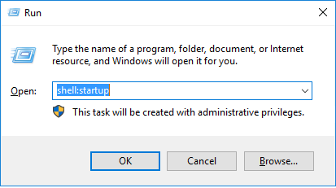
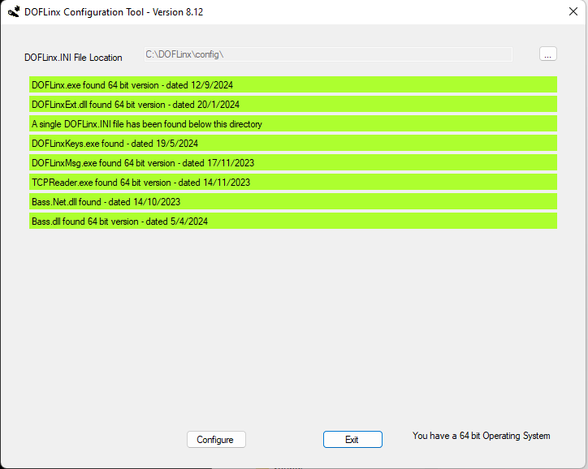

# Installation

1.	Create a folder for DOFLinx, let’s call it C:\DOFLINX
2.	Download DOFLinx from here [https://github.com/DOFLinx/DOFLinx/releases](https://github.com/DOFLinx/DOFLinx/releases) into C:\DOFLINX
3.	Unblock the downloaded DOFLinx.Vxx.ZIP file
4.	Unpack C:\DOFLINX\DOFLinx.Vxx.ZIP into the same folder
5.	Copy the premade DOFLinx-Shortcut.lnk to startup.

  	To open the startup folder in Windows use Win-R and type in shell:startup
  	

6.	Run DOFLinxConfig
   a.	Check that you do not have any errors and that you understand any warnings
   b.	Press the “Configure” button and work through all of your settings.  Alternatively you can edit the supplied `DOFLinx.INI`

7.	Reboot
8.	Start Pinball FX or MAME and enjoy

Once installed you should have an installation looking something like that below.  Note the image below includes the Direct Output Framework (DOF) installed for running of output boards and toys (flashers, solenoids, etc)

