# Setting Up DOFLinx with MAME

_This guide will explain how to setup a dedicated arcade cabinet or pinball machine with MAME and  force feedback, live scores screen, addressable LEDs .  The guide is modelled on the setting up of my dedicated arcade cabinet, Arcade Universe.  If you have a pinball cabinet with MAME on it as well, then this guide will also help you understand what additional settings are required for DOFLinx._

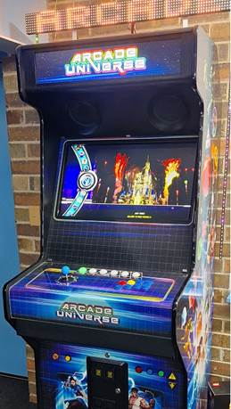  

## Prerequisites

To setup an arcade cabinet with force feedback you will need the following;

- Widows 64 bit, preferably Windows 10 or 11
- Direct Output Framework (DOF) if you are going to run addressable LEDs or toys
- MAME
- Probably some sort or front end, ie Pinup Popper
- An output device, ie Pinscape, LEDWiz, PacLED64, UIO, Pincontrol1, PinControl2, SainSmart, PacDrive, PinOne, Dude’s Cab
- Some toys
- Perhaps some addressable LEDs on a Teensy

In my Arcade Universe cabinet I have:

- Pinup Popper
- A Pinscape with 50+ outputs
- RGB lighting
- A teensy and addressable LEDs, a 96x8 matrix (Back FX) and two 60 LEDs (Left and Right MX)
- 5 RGB flashers
- A knocker
- Three solenoids configured as mid-left, mid-centre, mid-right
- Six RGB buttons for Start (coin), Exit, Reset, Pause, player 1 and Player2
- Mono LED buttons for System menu, coin, cheat, menu volume up / down
- A coin door with a couple of LED lit buttons and a coin door switch
- A joystick
- Eight buttons for game play, B1 to B8
- Main monitor
- A long shop display as screen #2 for the marquee
- A small monitor below the main play screen for high scores and live score
- Relays to switch the RGB, MX LEDs and flashers on / off from the DOFLinx Setup menu

You don’t need all of this, but much more is unlikely to get used productively.  Having said that, if you find a way or an idea, do let me know!

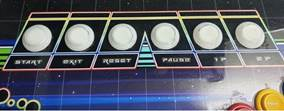 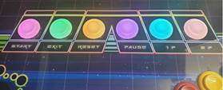

Buttons all unlit                                                 Buttons lit for Gyrus

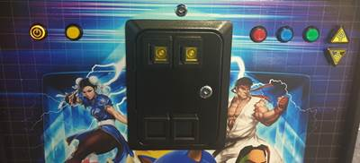

Front panel buttons

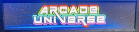      

Marquee at main menu                                Marquee when selecting and playing 1941

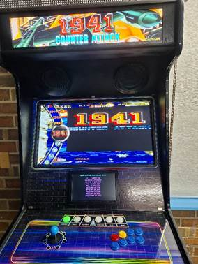  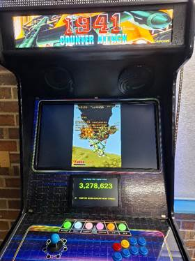

The DOFLinx built in score screen with Popper menu and displaying high scores on the left.  On the right is the score screen during game play.  To turn on the score screen add SCORE\_SCREEN=1 to your DOFLinx.ini.  You can drag the score screen around to the desired location during game play, but its easier if you start DOFLinx with DEBUG=1 and then use the right-click menu option to position and setup the screen.

## Software Setup

The software required piece by piece is described below.

## MAME

Within the DOFLinx release zip there is a subfolder for MAME\_EXE.  Within this folder are version(s) of MAME that have been modified to work with DOFLinx.  Pick a version of MAME that you wish to use, note the version, then install that version of MAME as freely available on the web (look in the downloads section of [https://www.mamedev.org/](https://www.mamedev.org/)).

Once you have installed the standard release of MAME then replace the MAME.EXE with the MAME\_xxx.EXE from the DOFLinx release zip.  Just rename MAME\_xxx.EXE to MAME.EXE.

Only the 64 bit version has been compiled and made available.

You will of course need your ROMs loaded in the ROM folder and any other MAME related material that you plan to use, ie cheats, marquees, etc.  Everything other than the inter-process communication is standard MAME.

Now that MAME is installed you need to modify your MAME.INI file to enable the TCP communication with MAME.  The section to modify is in the “OSD OUPUT OPTIONS”.  Set the “output” to “network”.  This is critical, nothing will work without this.

    # OSD OUTPUT OPTIONS  
    #  
    output                    network

Doing this allows DOFLinx and MAME to “chat” over TCP/IP using the default loopback address, so the traffic never leaves your PC, but is still on the standard TCP/IP stack.  The TCP/IP communication was introduced into MAME a fair way back, all I’ve done is add more messages.

## DOF

If you have a combined pinball / MAME cabinet, or like me, you have addressable LEDs in your arcade cabinet, then you need DOF installed as well.  If you just have an output device like a Dude’s Cab, LEDWiz, PinControl, etc then you do not need to install DOF.

I am assuming the DOF installation is in the C:\\DirectOutput\\ folder with config files in the C:\\DirectOutput\\Config\\ folder.  If you are using a Teensy for addressable LEDs you will need a valid GlobalConfig.XML and Cabinet.XML file.

## Hi2Txt

If you want DOFLinx to display high scores on either the built in DOFLinx score screen (as per images above) or a Pixelcade / DMD (via DOF2DMD) device then you will need to install Hi2Txt.  Hi2Txt can be found here [https://greatstoneex.github.io/hi2txt-doc/](https://greatstoneex.github.io/hi2txt-doc/) .  You can place it where ever you like but for this I’ll assume something logical like C:\\Hi2Txt\\

You then need to setup the parameter in DOFLinx.ini to point to your installation, so  
PATH\_HI2TXT=C:\\Hi2Txt\\

Or where ever you put your installation.

## DOFLinx

Install DOFLinx into your chosen folder, usually C:\\DOFLinx.  Unblock the EXE and DLL files.  Create sub-folders for the DOFLinx configuration and MAME files.  Place the MAME files into the MAME folder.

!!! Note

    Some of the images show the older installation of C:\\DirectOutput not C:\\DOFLinx, please read as C:\\DOFLinx

You should end up with a structure that looks something like this:

Create a shortcut for DOFLinx and place that in your Windows Startup Folder.  The Shortcut needs to point to your DOFLinx.INI file.

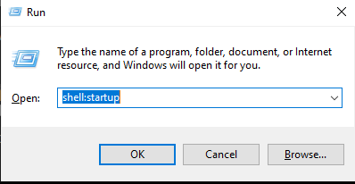

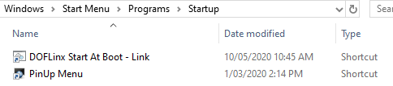

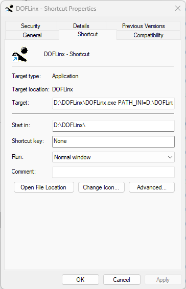

Your shortcut to start DOFLinx can be as simple as starting DOFLinx with and setting up according to its configuration file, or something a little more complex.  For Arcade Universe I want the cabinet name displayed on my MX LEDs.  To achieve this, I run a batch file for DOFLinx startup that also sends the necessary configuration messages.

You will notice in the batch file the loop that ensures the message is sent to DOFLinx.  This is done because, like any program, DOFLinx needs a little time to start before being able to process messages.  DOFLinxMsg returns an exit code that allows the success of sending the message to be determined.

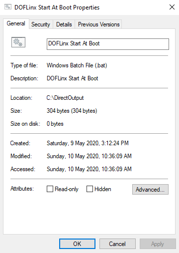

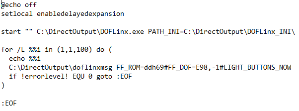

You now need to setup your DOFLinx.INI configuration file.  This contains all of the settings that make your arcade cabinet unique.  Details of all of the possible parameters can be found in the full DOFLinx guide.  Below is a copy of my current Arcade Universe DOFLinx.INI file.  The material in blue is the contents of the DOFLinx.INI file.  Added in red are additional comments for this guide.

Header and DEBUG section

    ####
    # The config file for DOFLinx on DDH69's Arcade Cabinet
    ####
    # 0 = OFF (normal operation), 1 = ON - When ON a window will appear and a log file will be created in the EXE directory.
    DEBUG=0
    
Pointers to DOF files and path to MAME files

    # location of your standard DOF output configuration file
    COLOUR_FILE=c:\DOFLinx\config\directoutputconfig.ini
    DIRECTOUTPUTGLOBAL=C:\DirectOutput\config\GlobalConfig.xml
    PATH_MAME=C:\DOFLinx\MAME\
    CLOSE_ROMS=0

The activating process name and specifying that this is a MAME process

    # When to activate, and more specifically what is the MAME process to kick things off
    PROCESSES=Mame64
    MAME_PROCESS=Mame64

Required if you are doing some development of MAME files of generally inquisitive, can be removed

    # Because I want the get triggers from each game as I play it, set this path to something
    MAME_TRIGGER_OUTPUT_PATH=C:\MAMETriggers\

MAME specific adjustment parameters

    # Shorten the default period between score checks because my computer is reasonably fast and its not impacting MAME game play
    MAME_SCORE_CHECK_PERIOD=100
    # Shorten these two defaults as I want effects driven by pressing the "fire" button to happen quickly, hence shorten the protective delays
    TRIGGER_DEBOUNCE_TIME=10
    DELAY_BETWEEN_KEY_PRESS=100

The details for setting up RGB cabinet lighting

    # What output(s) are used for RGB devices.  Just enter the Red output number.  Multiples can be entered separated by a comma
    RGB_OUTPUT=1062,1065
    # Rainbow - cycle through the colours, Random - pick a random next colour, A colour name as it appears in the DirectOutputConfig.ini file
    RGB_STYLE=RANDOM
    # What changes the colour?  Time - set time period, Flipper = flipper press after the RGB_TRIGGER minimum time (to stop rapid colour changes)
    RGB_TRIGGER=TIME
    # Dependent on trigger selection the period between changes or the minimum time for change between flipper flips
    RGB_MIN_TIME=3000

The setting up of the toys section

    # And yes, I do have 3 solenoids and a knocker in my arcade cabinet
    LINK_ML=1038,50,500,255
    LINK_MC=1039,50,500,255
    LINK_MR=1040,50,500,255
    LINK_KN=1041,90,500,255
    #Setup my 5 flashers
    LINK_FLOL=1023
    LINK_FLIL=1026
    LINK_FLCN=1029
    LINK_FLIR=1032
    LINK_FLOR=1035

Configuration of the various cabinet buttons

    #Configure all the buttons
    LINK_BUT_CN=1016,MONO,36,0000,MONO,35   Note #1 this line
    LINK_BUT_ST=1044,Lime,35
    LINK_BUT_EX=1047,Amber,1B
    LINK_BUT_RE=1050,Tomato,72
    LINK_BUT_PS=1053,Deep_Pink,50
    LINK_BUT_P1=1056,Cyan,31
    LINK_BUT_P2=1059,Orchid,32
    LINK_BUT_B1=1006,MONO,A2
    LINK_BUT_B2=1006,MONO,12
    LINK_BUT_CH=1019,MONO,75
    # The button(s) to turn on when MAME starts, ie the exit button LED
    # Since I'm using button names it need to happen after the LINK_ for the buttons are defined
    BUTTONS_LIT=BUT_ST

This gives the effect of lighting the button when its pressed

    # Let's make the volume up and down buttons light up when pressed
    KEY_TO_OUTPUT_TIMER=AE,122,500,AF,121,500

Not required by many, this section sets up a pop up DOFLinx menu that enables the turning on/off of various things during running operation.  For some of these you will need supporting electronics and cabling.  It enables me to turn on / off my RGB cabinet lighting, addressable LEDs and flashers.

    ####
    # Activated the settings menu by Left Joystick and 2P button
    # Use this settings menu to turn on / off my various lighting effects
    SETTING_ACTIVATE=25,32
    SETTING_UP=26
    SETTING_DOWN=28
    SETTING_CHANGE=35
    SETTING_EXIT=1B
    SETTING_MESSAGE=Joystick = Up/Down, Start = Change, Exit = Exit
    SETTING=RGB,107,Rear RGB Lighting Enabled,Off,Y,108,100
    SETTING=Flashers,109,Flashers Enabled,On,Y,110,100
    SETTING=Addressable,113,Addressable LEDs Enabled,Off,Y,114,100

!!!Note
    The line LINK\_BUT\_CN=1016,MONO,36,**_0000,MONO,35_** has a button LED output defined as “0000”, this is used where the button has no illumination but needs to be defined for its input code.  In my case, I am using my Start button (BUT\_ST) as and additional coin button.  As such, I want to monitor the input against the Coin function but only light the button as a Start button.

## Front End

I’ve chosen to us PinUp Popper for the front end menu system.  There were two reasons for this, firstly I’d never set it up before (I have PinballX on my pinball cabinet) and it looked fun, secondly, I needed more video and images displayed by the menu.  Quite specifically I need the marquee images displayed on the top screen as you select each game from the menu.

I have added the ability for PinUp Popper to work with DOFLinx for menu navigation.  This allows any toy to be used without PinUp Popper needing to open and use DOF.  There is a separate guide on how to do this.

Overall MAME, and most other emulators, is designed to be started from the command line per game.  This means that your front end menu system needs to be able to run MAME and any other configuration per game.  My setup for MAME in PinUp Popper is shown below:

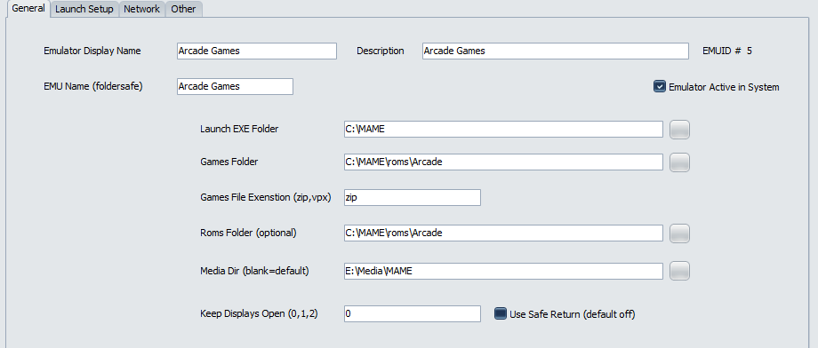

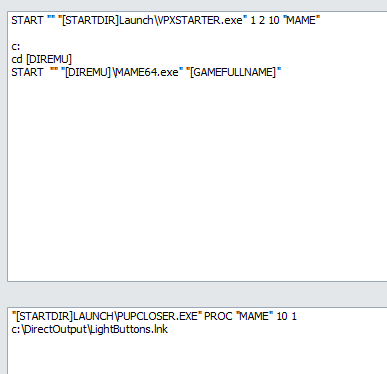

I also have settings that need to run in DOFLinx when things start and stop.  They can be seen below:

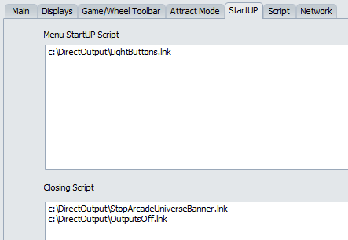

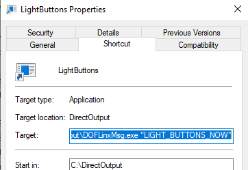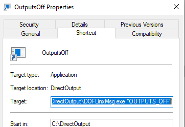

## Other Emulators

While this a guide about getting MAME and force feedback, not all games run through MAME.  One of my favourite retro games to tinker with (not play seriously) is the video story game, Dragon’s Lair.  This is played via the Daphne emulator.  I also have a PlayStation emulator and others will follow.

For these games setup of the MX effects and coloured LED buttons is required.  To do this I use shortcuts, and batch files (because of the parameter length restrictions of shortcuts), to run DOFLinxMsg.  DOFLinxMsg is one way to send messages to DOFLinx changing the configuration and initiating actions.

Below are my startup and shutdown scripts used around the Daphne emulator.

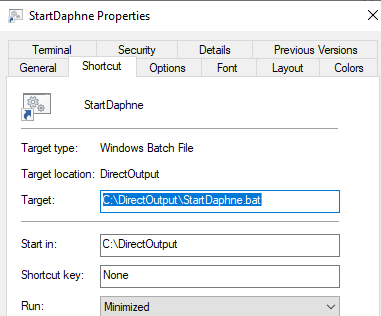

StartDaphne.Bat

    @echo off
    C:\DOFLinx\DOFLinxMsg.exe BUTTON_COLOUR_CHANGE=BUT_ST,Lime,BUT_EX,Black,BUT_RE,Black,BUT_PS,Black,BUT_P1,Black,BUT_P2,Black#LIGHT_BUTTONS_NOW
    C:\DOFLinx\DOFLinxMsg.exe FF_ROM=doflinx#FF_DOF=E78,7000#FF_DOF=E123,7000#BUTTON_COLOUR_CHANGE=BUT_ST,Deep_pink,BUT_EX,Forest_Green,BUT_RE,Dark_orange,BUT_PS,Dark_violet,BUT_P1,Dark_turquoise,BUT_P2,Salmon#BUTTONS_LIT=BUT_ST,BUT_EX,BUT_RE,BUT_PS,BUT_P1,BUT_P2#LIGHT_BUTTONS_NOW

StopDaphne.Bat

    @echo off
    C:\DOFLinx\DOFLinxMsg.exe "BUTTON_COLOUR_CHANGE=BUT_ST,Lime,BUT_EX,Amber,BUT_RE,Tomato,BUT_PS,Deep_Pink,BUT_P1,Cyan,BUT_P2,Orchid#BUTTONS_LIT=BUT_ST#LIGHT_BUTTONS_NOW"

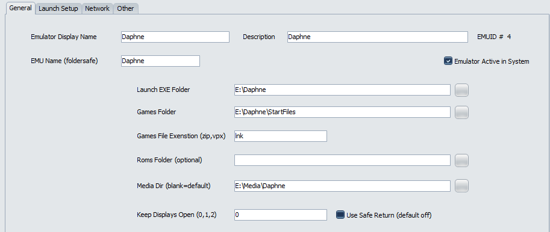

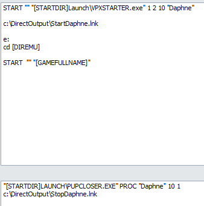

## Running games

## NES

Nintendo Entertainment System (NES) games run within MAME.  They run in a specific sub-machine being the NES machine.  That means when an NES game is started in MAME it only ever reports the game name of “NES”, not the actual game itself.  To apply the correct xxx.MAME file for a NES game the file name must be NES.MAME

This little inconvenience is handled by naming the appropriate NES game MAME file to be simply NES.MAME just before starting MAME.  Below is my setup.

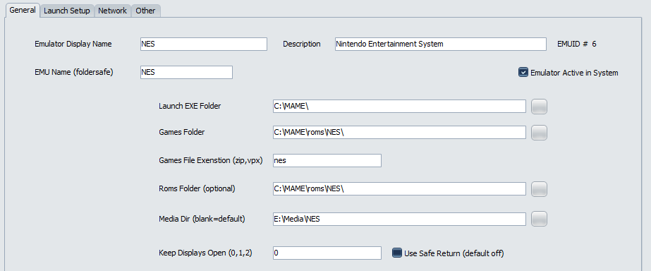

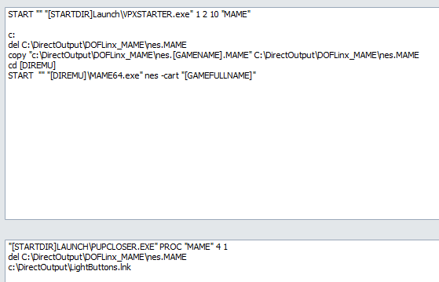
