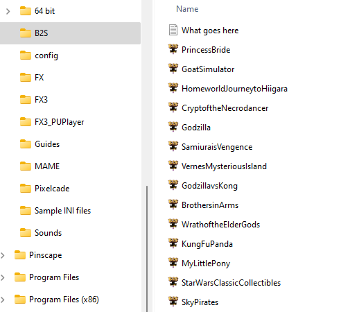

# Enabling Pinball M

1.       Copy DOFLinxTrigger.dll from where you unzipped the DOFLinx download to the same folder as PinBallM-Win64-Shipping.exe

2.       Make sure that you’ve got the LINX files from the \\LINX folder in the DOFLinx download zip in a folder where you want them, ie C:\\DOFLinx\\LINX\\

3.       Edit your DOFLinx.INI to

a.       Make Pinball M activate DOFLinx by adding in the LINX_PROCESSES= line PinballM-Win64-Shipping . Take note that the LINX_PROCESSES= lines MUST appear later in DOFLinx.INI than the PROCESSES= line  
Note; PinballM-Win64-Shipping is the process to monitor for, but you still run PinballM.exe to start PinballM.
 
b.       have the PATH\_LINX= parameter point to the place you put the LINX files in step #2 above

c.       have the PATH\_LINX\_B2S= parameter point to the place you have / will place your set of Pinball FX active back glasses  
  

  

4.       Get the complete set of active back glasses from [https://github.com/DOFLinx/B2S-Back-Glasses/releases](https://github.com/DOFLinx/B2S-Back-Glasses/releases) and place them in the folder you just setup in 3c above.  
  

  

5.       Start Pinball M

6.       Go to Settings | Cabinet

7.       Activate cabinet mode if it is not already

8.       Go to the DOFLinx tab, enable it

9.       Start it all up and have fun.

!!! Note

    A couple of people have reported that PinballFX will not “talk” to DOFLinx if DOFLinx is set to 
    “run as administrator”.  Check this if you have a problem.  
    Running as administrator is an older concept with a lot of pinball software that is not needed any longer.
