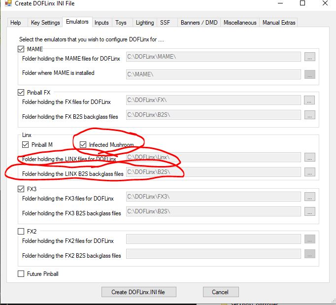

# Enabling Pinball Infected Mushroom Pinball

In most cases following a standard installation fo DOFLinx and using the default configuration file you will not need to do anything as Infected Mushroom Pinball is setup by default.
Follow the below to enable on existing installations or check that your setup is correct.

Method 1 - Using the User Interface

1. Start the DOFLinxConfig program from your DOFLinx folder.
  
2. If there are no errors, select the "Configure" button.
   
3. Select the "Emulators" tab.

   
4. Ensure there is a tick in the "Infected Mushroom" check box
   
5. Ensure the folders for the Linx and Linx B2S files point to the location where you have placed these files.  The default for the Linx files is \DOFLinx\Linx\ .  There are currently no active backglasses for Infected Mushroom Pinball, so the path is ultimately irrelevant, but valid for other Linx based emulators such as Pinball M.

6. Press the "Create DOFLinx.ini File" button.

7. Restart DOFLinx.
   
8. Enjoy.

Method 2 - Editing Your DOFLinx.ini File

1. Add / setup your paths to the Linx folders

    PATH_LINX=C:\DOFLinx\Linx\
    PATH_LINX_B2S=C:\DOFLinx\B2S\

2. Add / setup both IMPinball and IMPinball-Win64-Shipping to your PROCESSES_LINX= line.  If you don't have the line then add it.  This line must be lower in your INI file than your PROCESSES= line.
PROCESSES_LINX=PinballM-Win64-Shipping,IMPinball,IMPinball-Win64-Shipping

3. Restart and enjoy.
