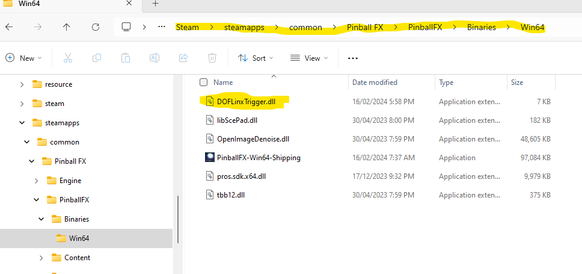
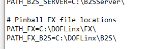
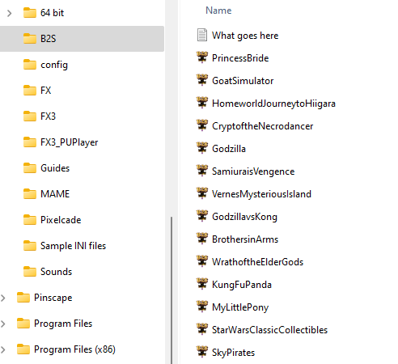
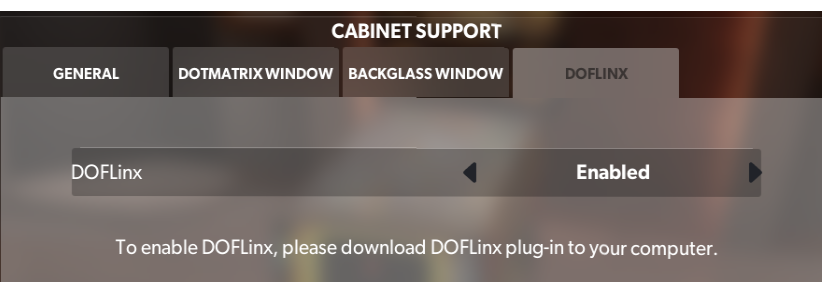

# Enabling Pinball FX

1.       Copy DOFLinxTrigger.dll from where you unzipped the DOFLinx download to the same folder as PinBallFX-Win64-Shipping.exe

2.       Make sure that you’ve got the FX files from the \\FX folder in the DOFLinx download zip in a folder where you want them, ie C:\\DOFLinx\\PinballFX\\

3.       Edit your DOFLinx.INI to

a.       Make Pinball FX activate DOFLinx by adding in the PROCESSES= line PinballFX-Win64-Shipping , So if you wanted MAME and PinballFX to activate DOFLinx you would have PROCESSES=Mame64,PinballFX-Win64-Shipping  
Note; PinballFX-Win64-Shipping is the process to monitor for, but you still run PinballFX.exe to start PinballFX.

b.       have the PATH\_FX= parameter point to the place you put the FX files in step #2 above

c.       have the PATH\_FX\_B2S= parameter point to the place you have / will place your set of Pinball FX active back glasses  
  

  

4.       Get the complete set of active back glasses from [https://github.com/DOFLinx/B2S-Back-Glasses/releases](https://github.com/DOFLinx/B2S-Back-Glasses/releases) and place them in the folder you just setup in 3c above.  
  

  

5.       Start Pinball FX

6.       Go to Settings | Cabinet

7.       Activate cabinet mode if it is not already

8.       Go to the DOFLinx tab, enable it

9.       Start it all up and have fun.

!!! Note

    A couple of people have reported that PinballFX will not “talk” to DOFLinx if DOFLinx is set to 
    “run as administrator”.  Check this if you have a problem.  
    Running as administrator is an older concept with a lot of pinball software that is not needed any longer.
