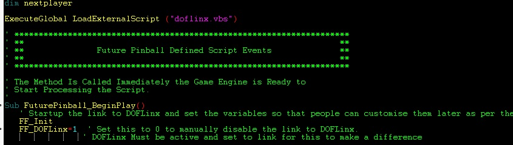
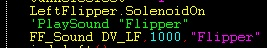
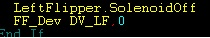
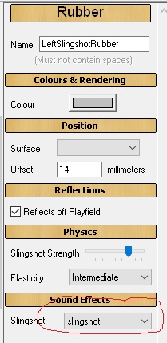
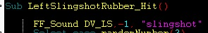
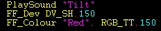
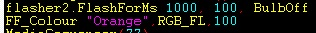
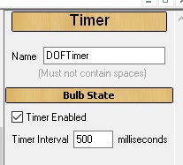
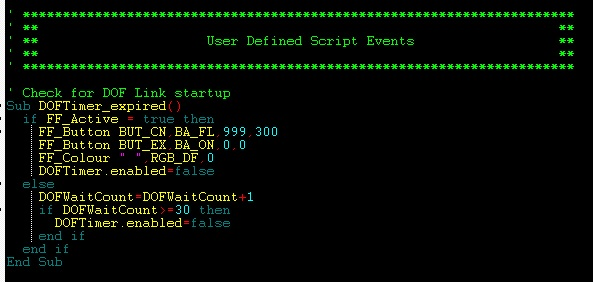

# Future Pinball Link

With the addition of some code Future Pinball (FP) can be set to message
DOFLinx directly. This allows FP tables to be DOF'ed.

## Assumptions

1. DOFLinx is installed and working
1. Future Pinball is installed and working

## How does this work?

DOFLinx detects the FP process, then it waits for the FP table to
initialise. If the FP table has DOFLinx code setup within it then a flag
is set in memory that DOFLinx reads. DOFLinx then sets its own flag for
FP that details the capability, ie shaker, gear, knocker. FP then sends
messages by setting memory values to DOFLinx. DOFLinx continuously
monitors for these messages while the FP process remains active and
processes them as appropriate.

DOFLinx has parameters to identify the various solenoids, contactors and
toys. FP messages DOFLinx by function, not device / port. In other
words, FP would send a message like Left Flipper on for some time. Its
then up to DOFLinx to interpret and process that message. As such
DOFLinx must know what port, etc to use for each device.

Multiple versions of FP have been tested. Any version should work. No
changes have been made to FP to allow this to work.

In a slightly more technical sense, when enabled via the
FP_ATTEMPT_LINK=1 and with FP listed in the PROCESSES= parameter, ie
"PROCESSES=Pinball FX2,Future Pinball" DOFLinx will look for a link to
FP when the FP process starts. If FP_ATEMPT_LINK=0 then DOFLinx will
operate as normal and listen to the keyboard keystrokes.

If the link is set to run within DOFLinx but not set up within the FP
table you are starting, then the link attempt will time out and DOFLinx
will handle Future Pinball as per its other configuration.
To get a link to FP, the FP table must have the DOFLinx code inserted
into it and activated. Examples of how to do this are below.

## How do I set up for this?

To set yourself up do the following:

1. Ensure you have "Future Pinball" as one of your processes, ie
  "PROCESSES=Pinball FX2,Future Pinball" in your DOFLinx.INI file.
1. Add the parameter FP_ATTEMPT_LINK=1 to your DOFLinx.INI file
1. Setup all of your LINK_xx= parameters where
  xx=LF,RF,LS,RS,ML,MC,MR,BL,BC,BR,SH,GR,KN,ST,EB,CN,EX,LB,FN.SR,BK
1. Add DOFLinx.vbs to your FP scripts folder. If your folder structure
  was C:\FP\Tables then this folder would be C:\FP\Scripts.
1. Run your DOF'ed FP table.
Below is a sample section of the DOFLinx.INI file to configure the
various devices. This is my setup, so be sure to edit it for your device
/ port numbers, best default times for devices and desired maximum on
times.

```ascii
FP_ATTEMPT_LINK=1
LINK_LF=117,50,10000
LINK_RF=125,50,10000
LINK_LS=118,50,500
LINK_RS=126,50,500
LINK_ML=127,50,500
LINK_MC=128,50,500
LINK_MR=129,50,500
LINK_BL=130,50,500
LINK_BC=131,50,500
LINK_BR=132,50,500
LINK_SH=115,1000,5000
LINK_GR=116,750,10000
LINK_KN=124,120,500
LINK_ST=102
LINK_EB=101
LINK_CN=106,105,103
LINK_EX=104
```

### If I want to DOF a table, how do I do it?

The FP code for DOF'ing a FP table is designed to be added in and left
in regardless of DOFLinx being used. Ideally table authors will add this
code to their tables in the same way it has been done for VP tables.

The mechanics of the process are:

1. Directly below your "Dim" statements add the line "ExecuteGlobal
  LoadExternalScript ("DOFLinx.vbs")
2. As the first items in the standard FuturePinBall_BeginPlay() section
  add the lines "FF_Init" and "FF_DOFLinx=1"
3. Now do your coding.

The image below shows the above steps implemented.



At its simplest replace "PlaySound xx" statements for flippers,
slingshots, drop targets, bumpers and jets with "FF_Sound LF,-1,xx". The
format is "FF_Sound DD,HHHH,SSSSS" , SSSSS is the original sound. The
original sound is played when the DOFLinx link is not active. DD is the
device signified by the device code (constant in the DOFLinx.vbs file).
HHHH is the time to turn the device on for in hundredths of seconds, the
special value of -1 will use the default on time setup by the user in
the DOFLinx.INI file.



The image above shows the line that was, and the new line that replaces
it. The left flipper is turned on for 10 seconds in this command. This
will keep the left flipper on for a reasonable time or until the key is
released and another "FF" command turns it off. If the user has set
their maximum on time for this device to less than 10 seconds to protect
their solenoids, then the left flipper solenoid will release sooner. It
would be quite reasonable to set to time to 999999 upon flipper press.



In the key released section, you then turn off the left flipper off.
For a simple flipper "bang" you could use time "-1" when turning the
flipper on, and not turn the left flipper back off. This would use the
users default on time for this device. Best practice is to turn it on
then back off.

More complex programming can be performed using a few more supplied
procedures and functions:

## Functions

### FF_Active -- Boolean

Used to test if the link from FP to DOFLinx is active. True when the
link is active, false when it is not.

### FF_ISDevice(DD) -- Boolean

Allows you to test if a specific device is configured for the cabinet
this table is being played on. The function will return true if the
device is configured.

Generally testing for a device is not required. If a message is sent for
a device that does not exist, then the message will simply be ignored.
Testing for devices is used by the supplied procedures FF_SOUND and
FF_SOUNDVOL to determine if the device exists when determining if the
original sound should be played or not.

So, for example, there is no need to test if the Coin button exists
before setting it to flash. Just set it, and if it exists, it will
flash, if not, nothing will happen.

Valid devices to test are:

```ascii
DV_LF = Left flipper
DV_RF = Right flipper
DV_LS = Left slingshot
DV_RS= Right slingshot
DV_ML = Mid field left solenoid
DV_MC = Mid field centre solenoid
DV_MR = Mid field right solenoid
DV_BL = Back left solenoid
DV_BC = Back centre solenoid
DV_BR = Back right solenoid
DV_SH = Shaker motor
DV_GR = Gear motor
DV_KN = Knocker
DV_FN = Fan
DV_SR = Strobe
DV_BK = Beacon
DV_BE = Bell
DV_C1 = Chime 1 (high)
DV_C2 = Chime 2
DV_C3 = Chime 3 (low)
DV_RGB = RGB lighting
DV_FLOL = Flasher, outside left
DV_FLIL = Flasher, inside left
DV_FLCN = Flasher, centre
DV_FLOR = Flasher outside right
DV_FLIR = Flasher, inside right
BUT_ST = Start button
BUT_EB = Extra Ball button
BUT_EX = Exit button
BUT_CN = Coin button
BUT_LB = Launch ball button
BUT_FR = Fire button
BUT_P1 = Player 1
BUT_P2 = Player 2
BUT_PS = Pause
```

## Procedures

### FF_Button DD,AA,IIIII,HHHHH

- DD -- Button device to activate

  ```ascii
  BUT_ST = Start button
  BUT_EB = Extra Ball button
  BUT_EX = Exit button
  BUT_CN = Coin button
  BUT_LB = Launch ball button
  BUT_FR = Fire button
  BUT_P1 = Player 1
  BUT_P2 = Player 2
  BUT_PS = Pause
  ```

- AA - The action to perform

  ```ascii
  BA_ON =Turn the button LED on
  BA_OFF = Turn the button LED off
  BA_TT = Turn on the button LED for the supplied hundredths of a second
  BA_FL = Flash the button LED for the number of iterations with the supplied time being the   duration between iterations
  BA_FD = Fade the button LED up and down for the number of iterations with the supplied time   being the duration to fade up / down
  ```

- IIIII -- The number of iterations to perform the action. For flash and
fade cycles on is one iteration and off is another. So, if you want the
button to flash on then off its 2 iterations. This way you can flash or
fade a button LED leaving it on or off when the cycle is finished.

- HHHHH -- Hundredths of seconds per iteration

### FF_Colour CCCCC,AA,HHHHHH

- CCCCCC -- a valid DOF colour name, ie Red, Light_cyan. "Random" is a
valid colour name and will simply display a random colour from the
currently active colour palette.
- AA -- the action to perform
  - RGB_DF = Start the default RGB colour cycle as set by the user in
    DOFLinx. This will give automatic colour changes based on a fixed user
    set colour, flipper initiated changes, or timed changes using either
    the full colour palette or a restricted palette, as per standard
    DOFLinx parameter and GAME_COLOUR settings. The colour name supplied
    (CCCCC) is irrelevant for this action. Once started for a game the
    default colour run cannot be stopped. It is an easy way to add colour
    with one command for the entire table.
  - RGB_TT = Change the RGB's to the supplied colour for the supplied time
    then revert to the colour displayed before the command.
  - RGB_CH = Change the colour to the new colour and leave it on until
    over written by further commands.
- HHHHHH -- hundredths of seconds to turn on the colour for. Maximum is
999999 or 9999 seconds.

### FF_Dev DD,HHHHHH -- Activate a device for the specified time

Turn on the device code for the specified time. The special time of
minus one (-1) will use the default run time set by the user in their
DOFLinx.INI parameters. An on time of zero (0) will turn the device off
from a previous on command if the time period has not yet elapsed.

This command is used when there is no sound required when the DOF link
is not operational. It is the same as FF_Sound DD,HHHHHH, " "

### FF_DOF T,EEE,HHHHHH

This command triggers Direct Output Framework events as defined in the
various DirectOutputxx.ini files. It is initially designed to trigger
addressable LED commands, but there is no reason that any other "E" type
command can't be triggered.

- T=Type, normally "E"\
- EEE = The event trigger number\
- HHHHHH = The duration to leave the trigger on in hundredths of seconds. Two
special values exist, zero (0) will turn the trigger off, and minus one (-1)
will turn the event on with no off time, normally for cases where the event has
its own timer within DOF.

FF_DOF "E",123,100 will turn on DOF event E123 for 1 second
Note you must have first opened a ROM via the FF_ROM command to use any
FF_DOF commands.

### FF_Flasher DD,AA,IIII,HHHHH,PPP,CCCCC

- DD- The device to activate.

  ```ascii
  DV_FLOL = Flasher, outside left
  DV_FLIL = Flasher, inside left
  DV_FLCN = Flasher, centre
  DV_FLOR = Flasher outside right
  DV_FLIR = Flasher, inside right
  ```

- AA - The action to perform

  ```ascii
  FL_ON =Turn the flasher on
  FL_OFF = Turn the flasher off
  FL_TT = Turn on the flasher for the supplied hundredths of a second
  FL_FL = Flash the flasher for the number of iterations with the supplied time being the   duration between iterations
  FL_FD = Fade the flasher up and down for the number of iterations with the supplied time   being the duration to fade up / down
  ```

- IIIII -- The number of iterations to perform the action. For flash and
fade cycles on is one iteration and off is another. So if you want the
flasher to flash on then off its 2 iterations. This way you can flash or
fade a flasher leaving it on when the cycle is finished.
- HHHHH -- Hundredths of seconds per iteration
- `PPP` -- The maximum percentage intensity 0 -- 100. Ie, if set to 50 and
fade (FL_FD) the flasher will fade up to 50% of the supplied colour and
back to nothing.
- CCCCC -- The colour to use during the action. "Random" is a valid colour
name and will simply display a random colour from the currently active
colour palette.

### FF_Init -- initialise the force feedback (FF) link from the FP side.

This command must be executed as early as possible in table start up to
enable the link to function correctly.

### FF_PROC CCCCCC,AAAA

Used to run an external command, CCCCC, with argument, AAAA. Not used by
core DOFLinx but available for use if you want to have a table trigger
some sort of special external event via program or batch file.

### FF_PUPlayer CCCCC,SSSSSS,AAA

Used to run PUPlayer from FP. There are two CCCCC commands, PUP_INIT (1)
and PUP_EVENT (2). You must issue a valid PUP_INIT in a table before you
can issue PUP_EVENT commands. The PUP_INIT command should be placed in
your timer to test once the DOFLinx link is established.

The SSSSSS string will be the ROM name for a PUP_INIT command and the
Event code for a PUP_EVENT. Argument AAA is zero for PUP_INIT, and must
be a valid argument for a PUP_EVENT from 0 -- 255.

Sample commands are:

```ascii
PUPlayer PUP_INIT,"trn_174h",0
PUPlayer PUP_EVENT,"W11",255
PUPlayer PUP_EVENT,"W44",255
```

### FF_ROM RRRRRR

If you plan to use FF_DOF commands to trigger DOF events, ie addressable
LEDs, then you must start a ROM in the Direct Output Framework (DOF)
first. Normally the ROM started is not a real ROM like in VP, but a fake
ROM setup in the DOF Directoutput30.ini file to support things like
addressable LED commands.

The command is used as early in the FP scripts, but after FF_Init, and
after the link is established. The best place is in the DOFLinx timer
once the link is detected by the FP script as being in place. Sample
syntax is;

`FF_ROM "fp_motu"`

See FF_DOF for details on how to send DOF commands from FP scripts.

### FF_Sound DD,HHHHHH,SSSSS (replaces PlaySound SSSSS)

### FF_SoundVol DD,HHHHHH,SSSSS,VV (replaces PlaySound SSSSS,VV)

- SSSSS -- the sound to play when the FP to DOFLinx link is not active.
- VV -- The volume modifier for the standard PlaySound command
- DD -- the device to activate.

  ```ascii
  DV_LF = Left flipper
  DV_RF = Right flipper
  DV_LS = Left slingshot
  DV_RS= Right slingshot
  DV_ML = Mid field left solenoid
  DV_MC = Mid field centre solenoid
  DV_MR = Mid field right solenoid
  DV_BL = Back left solenoid
  DV_BC = Back centre solenoid
  DV_BR = Back right solenoid
  DV_SH = Shaker motor
  DV_GR = Gear motor
  DV_KN = Knocker
  DV_FN = Fan
  DV_SR = Strobe
  DV_BK = Beacon
  ```

!!! note

    SH,GR and KN will play the supplied sound unless DOFLinx
    indicates the required devices are present. With an active link
    presence is determined by DOFLinx having been supplied valid devices
    LINK_SH, LINK_GR and LINK_KN via the DOFLinx.INI configuration file.*

- HHHHHH -- hundredths of seconds to turn on the device for. Maximum is
999999 or 9999 seconds.

Automatic sounds set on the object should not be used in this design.
Doing so will cause the sound to play regardless of force feedback being
active or not. For objects with sounds set you will need to remove the
default sound and add the FF_Sound line, ie there is no PlaySound line
to replace.



In this example the sound effect was "slingshot", it should be set it to
"none" and then add the line below in the "_hit" code.



Actions can be added to other events on the table. For example, when the
user tilts the following will run the shaker motor and flash the RGB
devices red. The PlaySound "Tilt" was the original action. The new
actions simply add to that.



An example of complementing a playfield flasher with the RGB flashing
the same colour for the same time is given below. Note the FF_Colour is
measured in hundredths of seconds (value of 100 below) whereas the
FlashForMs is in milliseconds (value of 1000 below).



If you want to set some force feedback items when a table starts (ie
start colours, set button LEDs) you will need to set up a timer. The
reason is that any force feedback control code, other than
initialisation stuff, placed in the FuturePinBall_BeginPlay() section is
likely to execute before the link has been properly established. Force
feedback control code executed before the link is properly established
will be effectively be ignored.

Doing this is simple, add a timer like this to the side of the
playfield.



Then add some code like that that below. With the timer set to 500ms the
table will test for an active link up to 30 times at ½ second intervals,
meaning it will test for 15 seconds after the table starts. The link is
normally up within 1 second, so a 15 second wait will be fine. Once a
link is detected some actions can be performed and the timer is disabled
for the rest of the game.

The lines to customise in the sample below are:

```ascii
FF_Button BUT_CN,BA_FL,999,300
FF_Button BUT_EX,BA_ON,0,0
FF_Colour " ",RGB_DF,0
```

Of course you can add more lines of code for initialisation. Be careful
to not remove the DOFTimer.enabled=false statement as you want the timer
to stop once it has been executed once.


