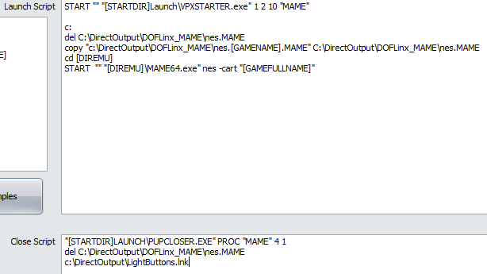

# MAME Commands, Triggers and Actions -- Full Force Feedback

You will need to use a version of MAME with the functionality added to
talk to DOFLinx. Install a version of MAME that matches the MAME64.exe
included with DOFLinx then replace MAME64.exe. In addition, you will
need to make sure the following is setup in your MAME.INI.

```ini
# OSD OUTPUT OPTIONS  
#  
output network
```

MAME files contain commands, triggers and actions that are run when MAME
games start and stop. In the same way as FX3 there are four XX.MAME
files;

1. `All_Pre.MAME` -- this is executed first for every MAME game when it
  starts
1. `Default.MAME` -- this runs for any game that does not have a game
  specific file
1. `XXXX.MAME` -- where XXXX is the specific MAME game that is running
1. `All_Post.MAME` -- this is executed last for every MAME game when it
  starts

Only three will ever be run. Only default or the game specific file (2
or 3) can run, not both.

The first three of these has the sections;

```ini
[STARTUP]  
[SHUTDOWN]  
[COMMANDS]  
[CLEAR COMMANDS]
```

The last has;

```ini
[COMMANDS]  
[CLEAR COMMANDS]
```

The actual game MAME file also has a [SCORE] section.

The [STARTUP] and [SHUTDOWN] sections contain pretty much any
parameters that can be contained in either the `DOFLinx.INI` or
supplementary INI files. For example, BUTTONS_ON= or FF_ROM= .

Both the [COMMANDS] and [CLEAR COMMANDS] sections contain the
triggers and actions associated with the trigger from the game. For
example, a trigger of "led0" can have both on and off actions such as;

```ascii
led0|ON|FF_Button BUT_P1,BA_ON,0,0  
led0|OFF|FF_Button BUT_P1,BA_OFF,0,0
```

The above will turn on the Player 1 button when led0 is "1" and turn it
off when led0 is "0". In many MAME games this effectively flashes the
Player 1 button when credits are inserted.

The [CLEAR COMMANDS] section exists to remove any commands that you do
not want processed. It is most often used in the All_Post.MAME file to
remove commands that are not relevant to your setup and may appear in a
number of other MAME files. It saves editing all of those game files
individually.

The [SCORE] section allows details for the polling of the score in the
MAME game. Monitoring of score changes and reaching particular scores
can be setup as triggers for any sort of actions.

One of the machines included with MAME is the Nintendo Entertainment
System (NES). Running a NES game in MAME is achieved using a command
line like

```cmd
MAME64 nes -cart Tetris.zip
```

When MAME starts it reports "nes" as the game not the individual
cartridge. As such, to get frce feedback via the correct MAME file for
DOFLinx you will need to have your front end (or some other method) copy
in the correct nes.XXXXXXXXX.MAME file to the nes.MAME file. Below is my
setup from PinUp Popper.


