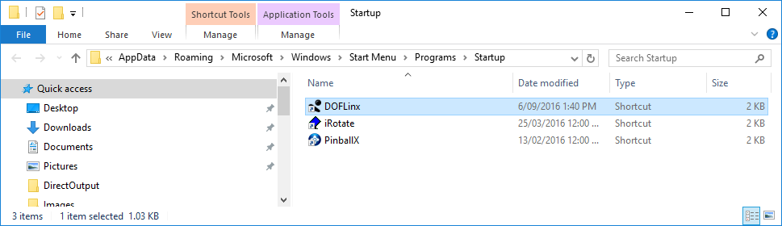

# Guide for Installation of Mame with Marquees and Animations on Windows

## Introduction
This guide will take you throught the steps required to setup like this video shows [https://youtu.be/hd0vPiH92E8](https://youtu.be/hd0vPiH92E8)

The setup shown is on a Windows 11 dual screen PC.  Both Windows 11 and the dual screen are irrelevant.  Windows 10 is fine, as is a single or tripple screen PC.

In addition to the steps required this guide will also provide additional setup commentary for other options available and point out what you can back to later and enhance.

If you have some of the software required for this setup already loaded, then still read through each step to ensure you have the configuration of that software as is required.

We will use both Windows Explorer and a command prompt for various parts of the setup.

## Step 1 - Mame
a) Create a folder C:\MAME

b) Download the version of Mame you require from here [https://www.mamedev.org/release.html](https://www.mamedev.org/release.html)  and place it in C:\MAME.  If you curently do not have Mame installed you would normally download the latest available.  You want to downnload the Windows binaries.  It will be a file like *** FILE ***

c) From Windows Explorer right-click on the Mamexxxxb_64bit.exe file, select Properies and un-block

d) Double click on the Mamexxxxb_64bit.exe file and agree to expand it to C:\MAME

e) Start a command prompt

f) Go to C:\MAME (cd /d C:\MAME)

g) Create a Mame config file (Mame -createconfig)

h) Edit Mame.ini, search for "output" to find the line "output     auto".  Now change that to "output    network"

i) Download the game ROMs you require to C:\MAME\ROMS\ from your favourite ROM download site.  Ideally at least download Galaga as we'll use that as an example here.

** CHECK POINT **
- From the C:\MAME command prompt run (without the quotes) "Mame -window galaga"
- The expected result is that the game Galaga will start in a window on screen.
- Check that you can pause and unpause the game using Shift-F8.
- Check that you can start a game, 5 for coin in, 1 for 1 player, left right arrows to move and Ctrl to fire.
- Check that F3 performs a soft reset on the game.
- If all of this is working then <ESC> to exit Mame and continue on.

!!! Note, if you already have Mame installed with differnt keys, don't worry, you can keep those and make adjustments later to accomodate.  DO not however start making configuration changes to Mame if you just installed it, that will make following this guide just that bit harder, come back and make those changes one at time later so you can easily tell if anything breaks once you have a working setup.

## Step 2 - DOFLinx
a) Create a folder C:\DOFLinx

b) Download the latest DOFLinx release from here [https://github.com/DOFLinx/DOFLinx/releases](https://github.com/DOFLinx/DOFLinx/releases)

c) From Windows Explorer right-click on the DOFLinx_Vxxx.zip file, select Properies and un-block

d) Double click on the DOFLinx_Vxxx.zip file and expand it to C:\DOFLinx

e) Copy the premade DOFLinx-Shortcut.lnk to startup.  To open the startup folder in Windows use Win-R and type in shell:startup

f) Copy the "C:\DOFLinx\DOFLinx Mame Integration\doflinx\" folder to C:\MAME\plugins\

g) Restart Windows

** CHECK POINT **
- Start a command prompt
- Go to C:\DOFLinx  (cd /d C:\DOFLinx)
- Type the command "DOFLinxMsg DEBUG=1" and press <ENTER>
- The expected result is that now see the DOFLinx window on screen
- Go to C:\MAME (cd /d C:\MAME)
- Run (without the quotes) "Mame -window galaga"
- The expected result is that the game Galaga will start in a window in screen and that you will see activity in the DOFLinx window.  The activity should show MAME being recognised and startup for Galaga.

## Step 3 - Hi2Txt
a) Create a folder C:\Hi2Txt

b) Download the latest c# Hi2Txt from here [https://greatstoneex.github.io/hi2txt-doc/](https://greatstoneex.github.io/hi2txt-doc/)

c) From Windows Explorer right-click on the downloaded zip file, select properties and un-block

d) Double click on the zip file and expand the contents into C:\Hi2Txt

## Step 4 - DOF2DMD
a) Create a folder C:\DOF2DMD

b) Download the latest DOF2DMD release from here [https://github.com/DMDTools/DOF2DMD/releases](https://github.com/DMDTools/DOF2DMD/releases)

c) From Windows Explorer right-click on the DOF2DMD.zip file, select Properies and un-block

d) Double click on DOF2DMD.zip and expand it into C:\DOF2DMD

** CHECK POINT **
- Double click on dof2dmd.exe
- Expected result is that a command prompt window opens then a DOF2DMD DMD window opens on top of that showing "DOF2DMD" logo

e) Click and drag the DMD to the desired position

f) Click and drag on the bottom right corner to resize

g) Right-click on the DMD and select "Save position for "DOF2DMD" (or "save position globally" if you want your DMD in this position for everything)

h) Close the command prompt window to stop DOF2DMD for now

!! Note, You will need to source your DMD logos and animations to go in C:\DOF2DMD\artwork\mame and C:\DOF2DMD\artwork\mameoutput
!! Note, I strongly suggest buying the artwork pack from Pixelcade as it will just make this work, alternatively you will need to collect a set of marquee artwork and make animation gifs.
!! [https://creativeartsandtechnology.com/product/pixelcade-led-art-pack-non-pixelcade/](https://creativeartsandtechnology.com/product/pixelcade-led-art-pack-non-pixelcade/)

## Step 5 - Configure DOFLinx for Hi2Txt and DOF2DMD
a) From C:\DOFLinx double click on DOFLinxConfig

b) Select "Configure"

c) Go to the "Banners / DMD" tab

d) Set the Hi2Txt folder to C:\Hi2Txt

e) Set the DOF2DMD folder to C:\DOF2DMD

** CHECK POINT **
- Start a command prompt
- Go to C:\DOFLinx  (cd /d C:\DOFLinx)
- Type the command "DOFLinxMsg QUIT" and press <ENTER>
- Type the command "DOFLinx PATH_INI=C:\DOFLinx\config\"
- The expected result is that you should see the DMD with the DOFLinx logo

** SYSTEM TEST **
- From the C:\MAME command prompt run (without the quotes) "Mame -window galaga"
- The expected result is that Galaga starts and the Galaga logo appears on the DMD
- Add a coin or two (press key #5)
- The expected result is you see the coin animation on the DMD as well as player 1 / player 2 selection
- Select Player 1 (press #1)
- The expected result is that you see the Player 1 animation and the game starts
- Play the game
- The expected result is that you see live scores on the DMD and game animations when you shoot alien craft
- Press <ESC> to quit Mame

## Step 4 - Pinup Popper
!! Note, you can use another front-end if you prefer, but Pinup Popper integrates via DOFLinx to display marquees on the DMD while you navigate
!! Note, Launchbox / Bigbox

a) Download and install PinUp Popper from here [https://www.nailbuster.com/wikipinup/doku.php?id=mame_setup](https://www.nailbuster.com/wikipinup/doku.php?id=mame_setup) following the thorough instructions

b) Once you have Pinup Popper running then add the DOFLinx specific links as detailed here [https://doflinx.github.io/docs/frontend-menu/03_popper.html](https://doflinx.github.io/docs/frontend-menu/03_popper.html)
